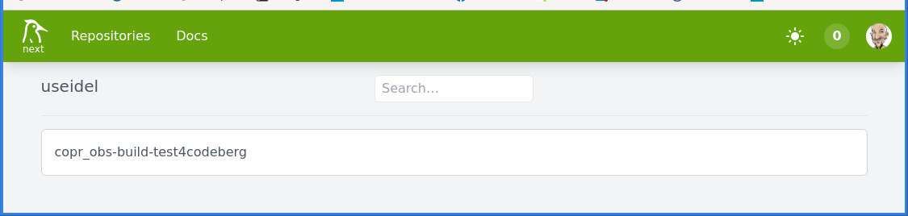
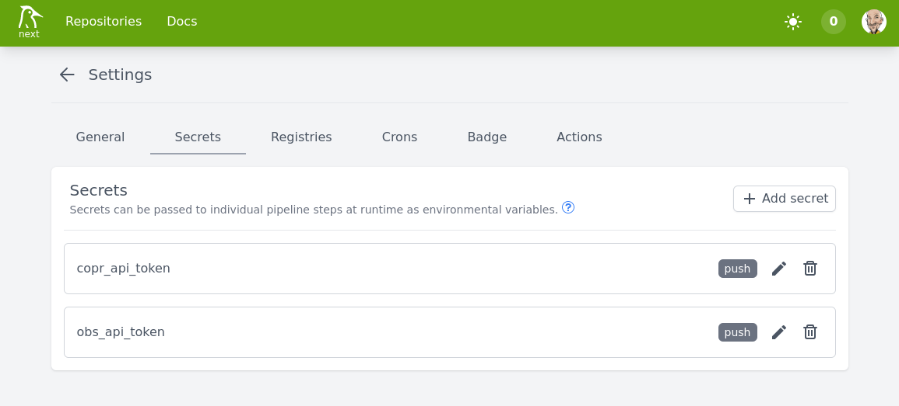

# copr_obs-build-test4codeberg

A playground to get used with codeberg-woodpecker. Why? Because [Codeberg](https://codeberg.org/) uses [Woodpecker](https://woodpecker-ci.org/) as the [CI platform](https://ci.codeberg.org/).

Coming from [Github Actions](https://github.com/features/actions) my biggest challenge was to use the [Woodpecker Secrets](https://woodpecker-ci.org/docs/usage/secrets) to store the tokens for the external build services. Given the approach of shell variables, the usage of multiline secrets is almost asking for challenges. I managed to get it working (see the woodpecker YAML file) but it does not look very smart. But hey - it works that way.
Very important: the secrets are stored on the woodpacker side of the pipeline and not on the codeberg repo side.

For the rest, I have basically copied my work from [here](https://github.com/useidel/copr_obs-build-test) ... just adapting to the specialities of codeberg-ci.

Lastly, this is still work in progress. Rebuilds are triggered via push events. A better approach would be using [Release events](https://docs.codeberg.org/git/using-tags/).

These are main basic steps in order to get it working
1. Create your repository (work place) at Codeberg
2. [Request access to the Codeberg-CI platform](https://codeberg.org/Codeberg-e.V./requests)
3. Once logged in to [Woodpecker](https://ci.codeberg.org/repos) you need to connect/import your Codeberg repo. 

That will implicitely setup two important things
  1. Creating an authorized Oauth2 application in your codeberg profile (see Settings -> Applications)
  2. Create the needed webhook (including target URL and Secrets) in your particular Codeberg Repo (see Seetings -> Webhooks)
4. Create the [.woodpecker.yaml](https://codeberg.org/useidel/copr_obs-build-test4codeberg/src/branch/main/.woodpecker.yaml) YAML file (and other needed scripts) in your Codeberg repo - see this my files in this repo.
5. If you need secrets (i.e. login credentials to external sites) -> store them on the Woodpecker side of the repo. 

6. Push your changes and see if it works

Additional information: it seems that renaming your repo on codeberg does not break the connection to woodpecker. But you will see there at least two repos: one with the old name and one with the new name.
